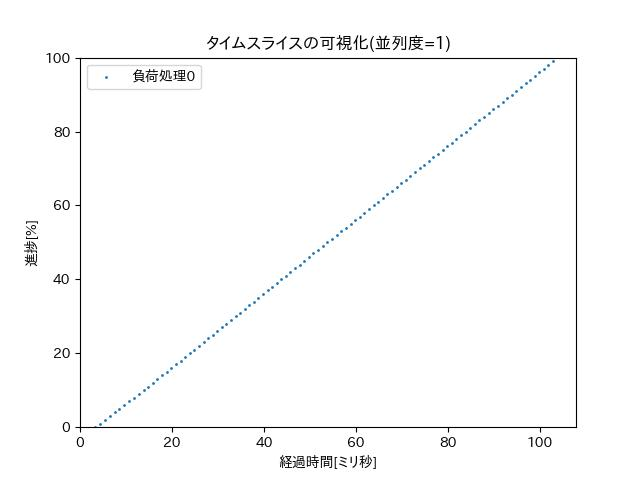
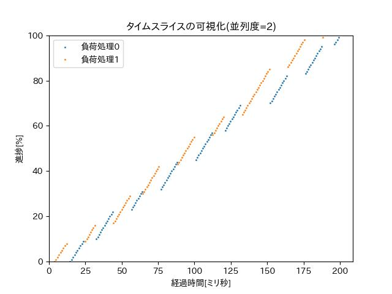
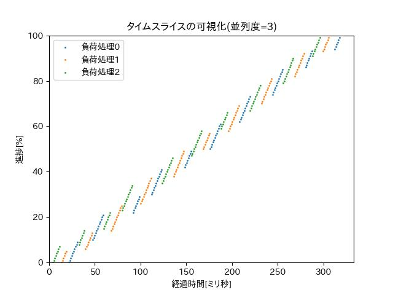
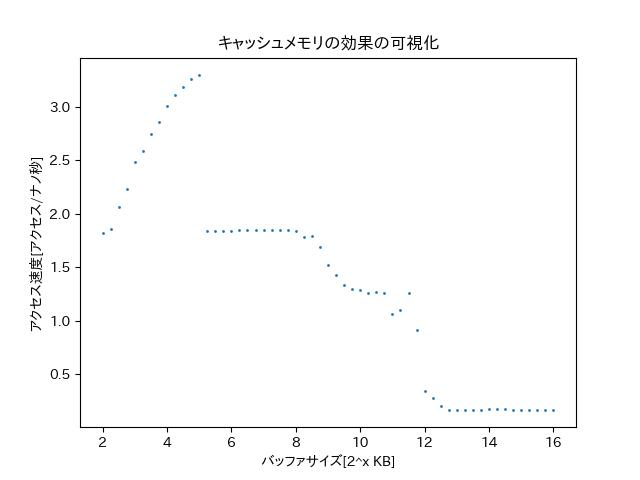

[［試して理解］Linuxのしくみ～実験と図解で学ぶOSとハードウェアの基礎知識](http://gihyo.jp/book/2018/978-4-7741-9607-7)実験プログラム

# おまけ

Ubuntu20.04において動作する、本書において書かれたCプログラムをGoやPythonに移植して、かつ、コメントを日本語にしたものを各章のmiscディレクトリに入れています。一部についてはグラフ描画もしてくれるように変更しました。

必要なパッケージは以下の通り。

binutils, build-essential, golang, python3-matplotlib, python3-pil, fonts-takao

## 2章

- [hello.go](02-syscall-and-non-kernel-os/misc/hello.go): [hello.c](02-syscall-and-non-kernel-os/hello.c)に対応するGoプログラム。`go build hello.go`でビルドできる
- [inf-loop](02-syscall-and-non-kernel-os/misc/inf-loop): [loop.c](02-syscall-and-non-kernel-os/loop.c)に対応するPythonプログラム
- [syscall-inf-loop](02-syscall-and-non-kernel-os/misc/syscall-inf-loop): [ppidloop.c](02-syscall-and-non-kernel-os/ppidloop.c)に対応するPythonプログラム

## 3章

- [fork](03-process-management/misc/fork): [fork.c](03-process-management/fork.c)に対応するPythonプログラム
- [fork-and-exec](03-process-management/misc/fork-and-exec): [fork-and-exec.c](03-process-management/fork-and-exec.c)に対応するPythonプログラム

## 4章

- [sched](04-process-scheduler/misc/sched): [sched.c](04-process-scheduler/sched.c)に対応するPythonプログラム。結果をグラフ化にして"sched-<並列度>.jpg"に保存。

以下、1CPU上でschedプログラムを動かした結果を示すグラフです。順番に1並列、2並列、3並列のものです。

## 5章

- [cow](05-memory-management/misc/cow): [cow.c](05-memory-management/cow.c)に対応するPythonプログラム
- [demand-paging](05-memory-management/misc/demand-paging): [demand-paging.c](05-memory-management/demand-paging.c)に対応するPythonプログラム
- [mmap.go](05-memory-management/misc/mmap.go): [mmap.c](05-memory-management/mmap.c)に対応するGoプログラム。`go build mmap.go`でビルドできる
- [filemap.go](05-memory-management/misc/filemap.go): [filemap.c](05-memory-management/filemap.c)に対応するGoプログラム。`go build filemap.go`でビルドできる
- [segv.go](05-memory-management/misc/segv.go): [segv.c](05-memory-management/segv.c)に対応するGoプログラム。`go build segv.go`でビルドできる

# 6章

- [cache.go](06-storage-hierarchy/misc/cache.go): [cache.c](06-storage-hierarchy/cache.c)に対応するGoプログラム。`go build cache.go`でビルドできる。

以下、cacheプログラムを1CPUコアあたりのL1d,L2,L3キャッシュ容量がそれぞれ32KB,512KB,4MBのCPU上で動かした結果を示すグラフです。

